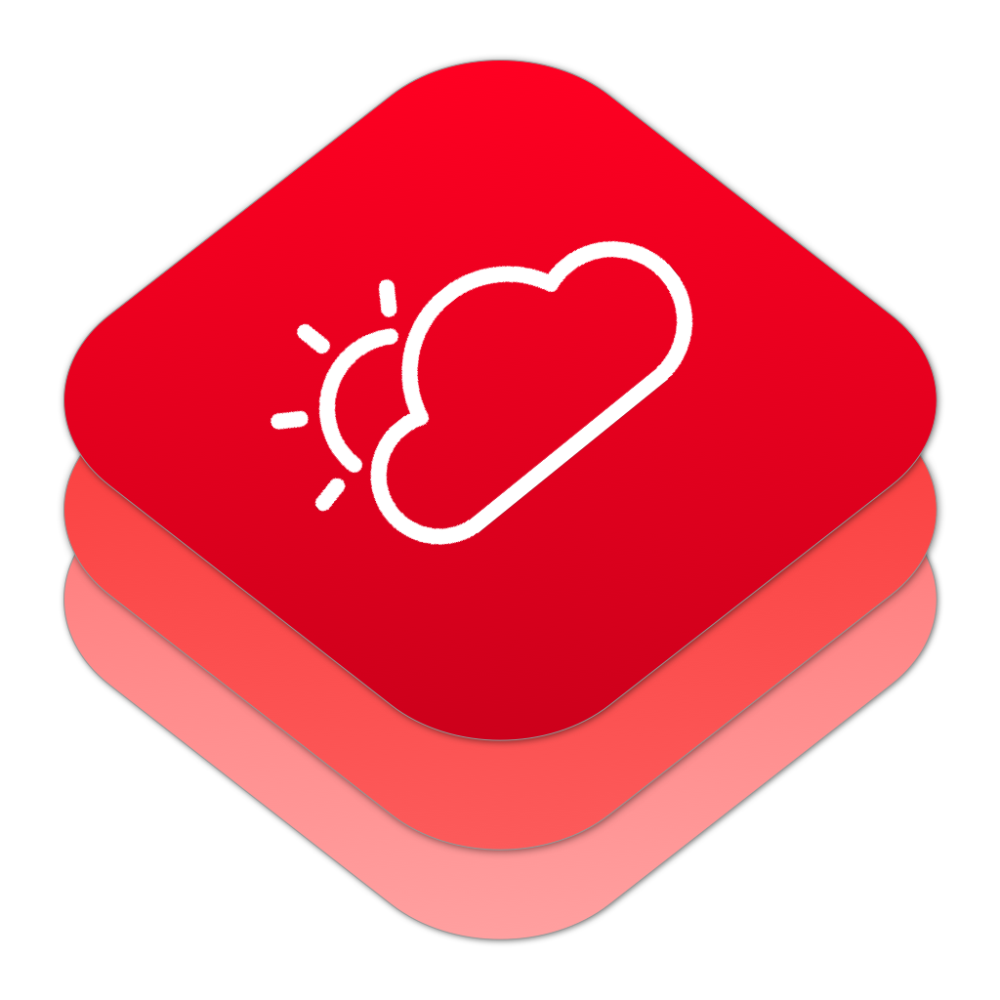

# Sample Weather App & WeatherKit
<p align="center"></p>

[](https://developer.apple.com/swift/)


[](https://github.com/Swiftification/StepFlow/master/LICENSE)

[](http://twitter.com/Vincedavis)

This is a sample weather app that was built per request. It was built using CocoaPods.

## Getting Started

Take a look at Demo project or the Playgrounds.

## Features

- [x] Find out weather conditions via location.
- [x] Search for weather conditions via search.
- [x] Save locations to view weather conditions at a later time.

## Todo

- [ ] Make it look pretty
- [ ] Wire up Today Widget
- [ ] Wire up Watch Extension

## Usage

Via [CocoaPods](http://cocoapods.org):

* Add `pod 'WeatherKit', '~> 0.0.1'` to your project's `Podfile`

## Using WeatherKit code

```swift
let weather = WeatherKit()
let location = CLLocationCoordinate2D(latitude: 42.3601, longitude: -71.058)
weather.getForecast(location) { result in
    switch result {
    case let .success(forecast):
        print("Forecast City - \(forecast.city)")
    case let .error(error):
        print("error - \(error)")
    }
}
```

## Requirements

* ARC
* iOS >= 10.0
* WatchOS >= 3.0
* Xcode 8

## License

SampleWeatheriOS and WeatherKit is available under the MIT License (MIT)

Copyright (c) 2016 Vince Davis (http://vincedavis.com)

Permission is hereby granted, free of charge, to any person obtaining a copy
of this software and associated documentation files (the "Software"), to deal
in the Software without restriction, including without limitation the rights
to use, copy, modify, merge, publish, distribute, sublicense, and/or sell
copies of the Software, and to permit persons to whom the Software is
furnished to do so, subject to the following conditions:

The above copyright notice and this permission notice shall be included in
all copies or substantial portions of the Software.

THE SOFTWARE IS PROVIDED "AS IS", WITHOUT WARRANTY OF ANY KIND, EXPRESS OR
IMPLIED, INCLUDING BUT NOT LIMITED TO THE WARRANTIES OF MERCHANTABILITY,
FITNESS FOR A PARTICULAR PURPOSE AND NONINFRINGEMENT. IN NO EVENT SHALL THE
AUTHORS OR COPYRIGHT HOLDERS BE LIABLE FOR ANY CLAIM, DAMAGES OR OTHER
LIABILITY, WHETHER IN AN ACTION OF CONTRACT, TORT OR OTHERWISE, ARISING FROM,
OUT OF OR IN CONNECTION WITH THE SOFTWARE OR THE USE OR OTHER DEALINGS IN
THE SOFTWARE.
